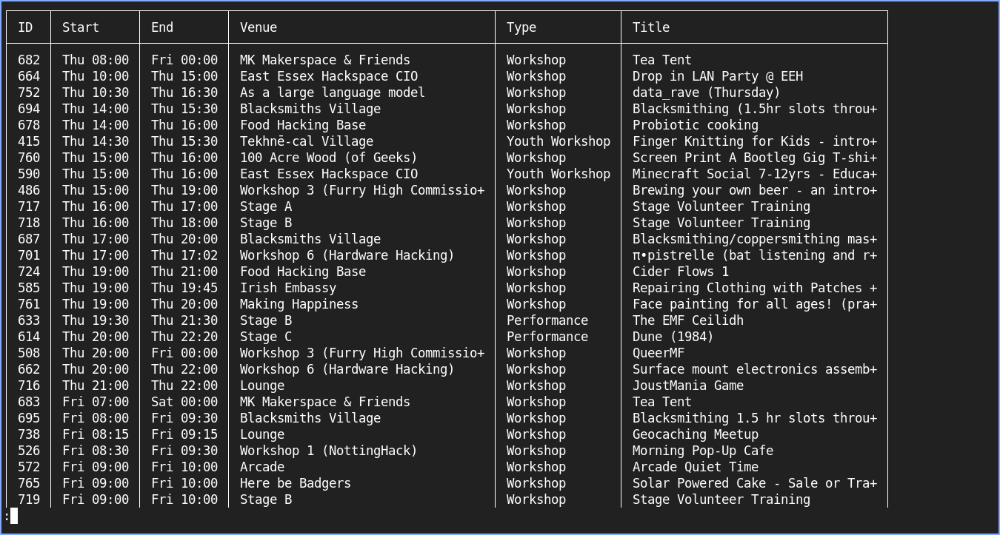

# Schedule CLI

A CLI for browsing the schedule.
Allows filtering, now-next, venue listing, all the good stuff that the client library exposes.



## Install

```shell
cargo install --git https://github.com/dannixon/emfcamp-schedule-api emfcamp-schedule-cli
```
